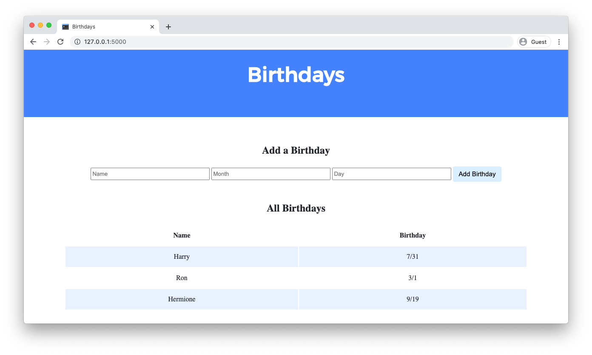

<h1 align="center">🧪 『 Birthdays Lab 』 🧪</h1>

### Description
The 'Birthdays' project is a mini project developed during the CS50 course, focusing on birthday management. It utilizes the Flask framework to create a web application that allows users to input a friend's name and birthday via a form. These details are sent through a POST request and subsequently stored in a database.

### Code Structure
The provided code snippet is a part of the project implemented in C# using the ASP.NET Core MVC framework.

### Implemented Features
- **GET Index()**: Retrieves the list of birthdays from the database for display in the View.
- **POST Index()**: Receives form data, validates it, and adds it to the database.

### Technologies Used
The code employs the following technologies:
- **ASP.NET Core MVC**: Framework used to build the web application.
- **Entity Framework**: Used as an Object-Relational Mapping (ORM) tool to interact with the SQLite database.

This code snippet represents the basic structure of the controller responsible for the logic of interacting with birthdays in the 'Birthdays' project.

<h1 align="center">📸『 Screenshots 』📸</h1>
